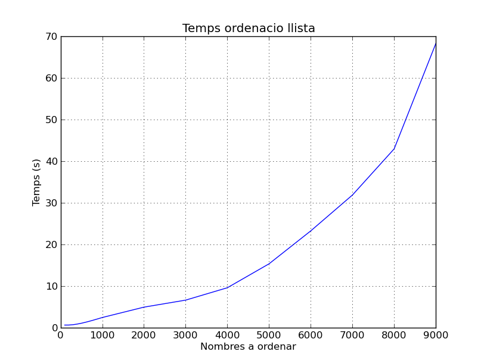

Informe practica 7
==================

:Authors: Sergi Carol i David Martin

:Date: 24/05/13

:Subject: Tecnologies de la programació

Introducció
-----------

En aquesta pràctica em pogut observar el temps d'execucció en els programes. En aquet cas hem pogut observar com els alogritmes recursius i de format 2^x . Com podrem observar els temps d'execucció queden extremadament grans.

Algoritme d'ordenació
---------------------

El algoritme **bubblesort** és un algoritme que s'encarrega de ordenar els numeros de una llista. En el nostre cas em creat l'algoritme de forma recursiva, aixó ha provocat un augment important del temps d'execucció.

L'alogortime té que tenir les següents restriccions:

* Per cada *i* desde 0 fins a *k* -1 si *li > li+1* intercanvieu els valors d’li i *li+1* .

* Si heu fet algun intercanvi, repetiu el pas anterior. En cas contrari, la llista ja està ordenada.

El nostre algoritme és el següent:

.. code-block:: python

	def bubble_sort(l):
		for x in range(len(a)):
		        try:
			        if a[x] > a[x+1]:
				    aux = a[x]
				    a[x] = a[x+1]
				    a[x+1] = aux
				    ordenar(a)
		         except:
			        pass

	         l = list(l)

.. raw:: pdf
   
   PageBreak

El fitxer eines
---------------

Apart del programa de ordenació també hem creat un seguit de funcions en les que creavem una llista de **n** elements aleatoris entre 1 i 2*n. A més a més teniem que crear un timer i un reset per aquet timer. Aquestes dues últimes funcions eren les encarregades de contar el temps d'execucció.

* El codi de la funció creadora de llistes és:
.. code-block:: python

	def llista(n):
	    i=0
            a=[]
            while n>i:
                ran=random.randint(0,(2*n))
                a+=[ran]
            
                i+=1
    
            return a	

* Per tal de fer el reset del timer vam utilitzar una simple funció utilitzant la llibreria **time**

.. code-block:: python

	def clk_reset():
	    start=time.time()
	    return start

* Per acabar aquet modul tenim la funcó que conta el temps trenscorregut desde l'últim reset del timer fins que s'activa aquesta funció:

.. code-block:: python

	def clk_counter(r):
	    temps_total=time.time()-r
	    return temps_total

.. raw:: pdf

   PageBreak

L'exprimentació
---------------

Primeres mesures
................

En aquest apartat començarem a utilitzar el moduls explicats anteriorment. Les experimentacions seran les següents:

* Generar una llista de 100 elements i ordenarla tarda **0.0024924993**
  
* Generar 100 llistes de 100 elements i ordenarles 10 vegades.
  - Amb aquestes mesures obtenim una mitjana : **0.0021649837**

* Generar 1000 llistes 1000 elements i ordenarles 10 vegades -
  - AMb aquestes mesures obtenim una mitjana de : **0.06824719905**

.. raw:: pdf
 
   PageBreak

Mesures finals:
...............

En aquestes mesures , ja més extenses ,tenim que fer les següents:

* n de 0 a 900 amb increments de 100.
* n de 1000 a 9000 amb increments de 1000.
* n de 10000 a 90000 amb increments de 10000.
* n de 100000 a 500000 amb increments de 100000. 

Degut a la gran quantitat de temps que tarda en realitzar les mesures vam decidir de parar el programa quant anava per *n=10000*, per lo tan les mesures de la gràfica és desde *0* fins a *9000*

Les mesures obtingudes són:

Ordenar cent llistes de 100 elements, triga una mitjana de:  0.69211022996902 segons

Ordenar cent llistes de 200 elements, triga una mitjana de:  0.71361712478547 segons

Ordenar cent llistes de 300 elements, triga una mitjana de:  0.75612947371358 segons

Ordenar cent llistes de 400 elements, triga una mitjana de:  0.79021238576485 segons

Ordenar cent llistes de 500 elements, triga una mitjana de:  0.86627797964322 segons

Ordenar cent llistes de 600 elements, triga una mitjana de:  0.91521598315264 segons

Ordenar cent llistes de 700 elements, triga una mitjana de:  1.04611872443429 segons

Ordenar cent llistes de 800 elements, triga una mitjana de:  1.58919054743567 segons

Ordenar cent llistes de 900 elements, triga una mitjana de:  2.77885113189521 segons

Ordenar cent llistes de 1000 elements, triga una mitjana de:  3.1450691878563 segons

Ordenar cent llistes de 2000 elements, triga una mitjana de:  4.318981464126 segons

Ordenar cent llistes de 3000 elements, triga una mitjana de:  6.93139224965 segons

Ordenar cent llistes de 4000 elements, triga una mitjana de:  9.48235005808 segons

Ordenar cent llistes de 5000 elements, triga una mitjana de:  15.27851398399 segons

Ordenar cent llistes de 6000 elements, triga una mitjana de:  23.25658780882 segons

Ordenar cent llistes de 7000 elements, triga una mitjana de:  31.83258550682 segons

Ordenar cent llistes de 8000 elements, triga una mitjana de:  42.92578893702 segons

Ordenar cent llistes de 9000 elements, triga una mitjana de:  68.25008580702 segons

.. raw:: pdf
   
   PageBreak

Aixó ens va donar la següent gràfica:

Suavització de la grafica
-------------------------

Per tal d'harmonitzar la gràfica i no tenir línies rectes, ajustarem la gràfica que ens ha donat a una equació polinòmica. Per a fer això utilitzarem el mètode "polyfit". Aquest mètode ens convertira tota aquesta gràfica en la funció que busquem:

*3.848e-21 x^6 - 9.332e-17 x^5 + 8.358e-13 x^4 - 3.291e-09 x^3 + 5.686e-06 x^2 - 0.001418 x + 0.6898*

Després d'utilitzar aquesta funció, ens resulta la següent gràfica:

Com podem veure, aquesta gràfica s'ajusta molt a la que ja havíem mostrat.

Conclusions
-----------

Després d'haver fet aquesta practica, ens hem donat compte de lo que comporta escriure un programa amb un codi o un altre.Hem pogut veure això perquè la primera vegada que vam fer el bucle "bubblesort" ho vam fer d'una manera recursiva, però vam veure que trigava moltíssim, i tardaríem moltíssim en fer el assajos. Finalment, vam optar per tornar a fer el programa, i ens va sortir un programa més ràpid.

No creiem que tindria tanta importància la manera en la que esta escrita el programa, i tan poca importància la velocitat de processament del processador. Segons s'ha vist en aquesta practica, lo que en realitat es necessita per a fer un bon programa, són uns bons algoritmes. Tenint això, pot arribar a ser indiferent el processador amb el que ho facis.
